# LIC_Amplifier_Configurations_Experiment-2
Design and comparative analysis of three amplifier configurations using 180nm CMOS in LTspice.
## AIM

To design and analyze a Common Source (CS) amplifier with PMOS active load using 180nm CMOS technology and evaluate its DC, Transient and AC performance.
## GIVEN SPECIFICATIONS

| Parameter | Value |
|------------|--------|
| VDD | 1.5 V |
| Power Constraint | ≤ 0.5 mW |
| Load Capacitor (CL) | 1 pF |
| Channel Length (L) | 180 nm |
| Assumed Overdrive Voltage (Vov) | 0.25 V |
| Source Voltage Drop (VRS) | 0.2 V |
---

# CIRCUIT 1  
## Common Source Amplifier with PMOS Active Load
### Circuit Diagram

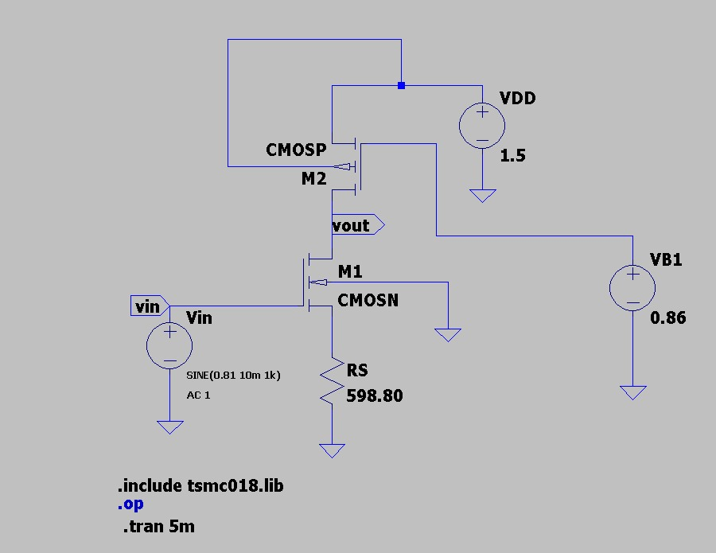
### Circuit Description

This circuit is a **Common Source (CS) amplifier with PMOS active load**.

- **M1 (NMOS)** acts as the amplifying transistor.
- **M2 (PMOS)** acts as an active load to increase gain.
- **RS** provides source degeneration for bias stabilization.
- **VB1** biases the PMOS transistor.
- Input signal is applied at the gate of M1.
- Output is taken at the drain node (Vout).

The circuit is designed to operate all transistors in the **saturation region** to ensure proper amplification.

## DC Analysis and Design Calculations

### Step 1: Drain Current from Power Constraint

Given:
VDD = 1.5 V  
P ≤ 0.5 mW  

P = VDD × ID  

ID = 0.5 mW / 1.5  
ID = 0.334 mA  

---

### Step 2: NMOS (M1) Width Calculation

Saturation current equation:

ID = (1/2) kn' (W/L) (Vov)²  

Rearranging for W:

W = (2 ID L) / (kn' (Vov)²)

Substituting values:

kn' = 2.30 × 10⁻⁴ A/V²  
L = 180 nm  
Vov = 0.25 V  
ID = 0.334 mA  

Wn ≈ 8.36 µm  

---

### Step 3: PMOS (M2) Width Calculation

ID = (1/2) kp' (W/L) (Vov)²  

W = (2 ID L) / (kp' (Vov)²)

kp' = 9.73 × 10⁻⁵ A/V²  

Wp ≈ 19.7 µm  

---

### Step 4: Source Resistor (RS)

Given VRS = 0.2 V  

RS = VRS / ID  
RS = 0.2 / 0.334mA  

RS ≈ 598.8 Ω  

---

### Final Designed Values

| Parameter | Value |
|------------|--------|
| ID | 0.334 mA |
| Wn | 8.36 µm |
| Wp | 19.7 µm |
| RS | 598.8 Ω |

The above calculations ensure proper DC biasing and saturation region operation.
## DC Simulation Results
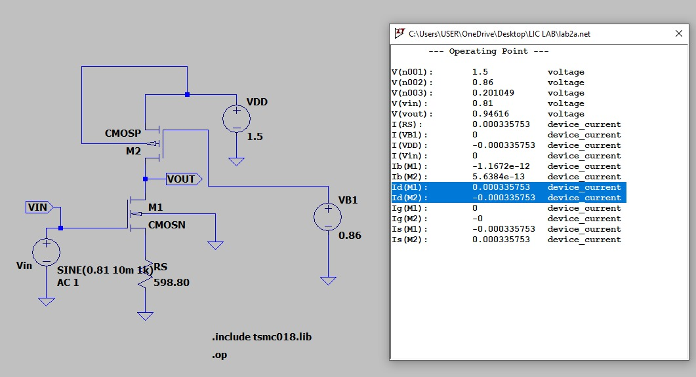

### Observations
- ID(M1) ≈ 0.335 mA  
- ID(M2) ≈ 0.335 mA  
- Vout ≈ 0.946 V  
- Source voltage ≈ 0.20 V  

The simulated drain current matches the calculated value (0.334 mA), confirming correct DC biasing.
### Width Tuning and Validation

| Parameter | Calculated | Final (Simulated) |
|------------|------------|------------------|
| Wn | 8.36 µm | 48.32 µm |
| Wp | 19.7 µm | 62.286 µm |

**Reason for Increase in Width:**

- Hand calculation assumes ideal square-law MOSFET model.
- 180nm model includes mobility degradation and short channel effects.
- Effective transconductance is lower in practical model.
- Larger W is required to maintain ID ≈ 0.334 mA.
- Width adjustment ensures proper Q-point and saturation region operation.

  ---

## Transient Analysis

A sinusoidal input signal was applied at the gate terminal:

Vin = SINE (0.9 10m 1k)

Transient command used:

.tran 5m
### Input Waveform (Vin)

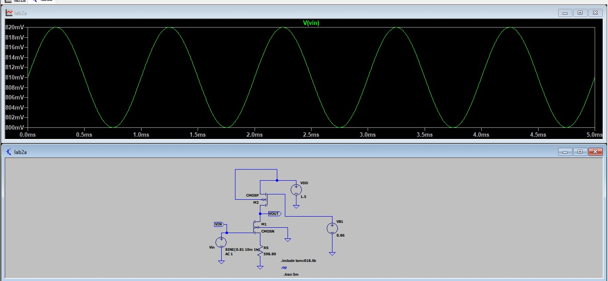

---

### Output Waveform (Vout)

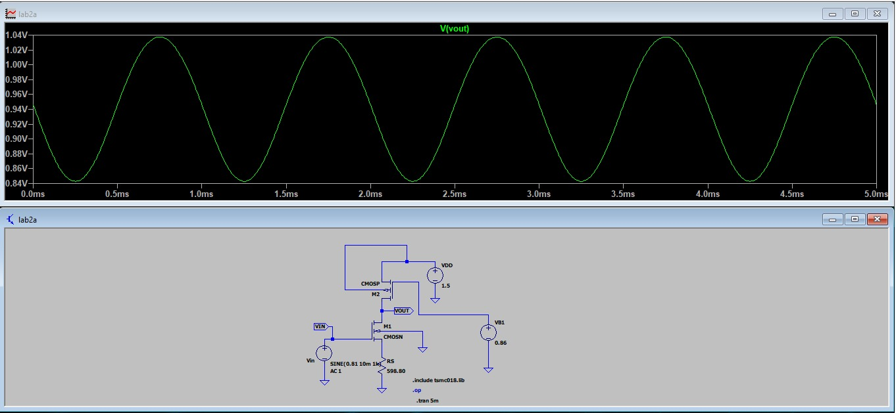

---

### Combined Input and Output Waveforms

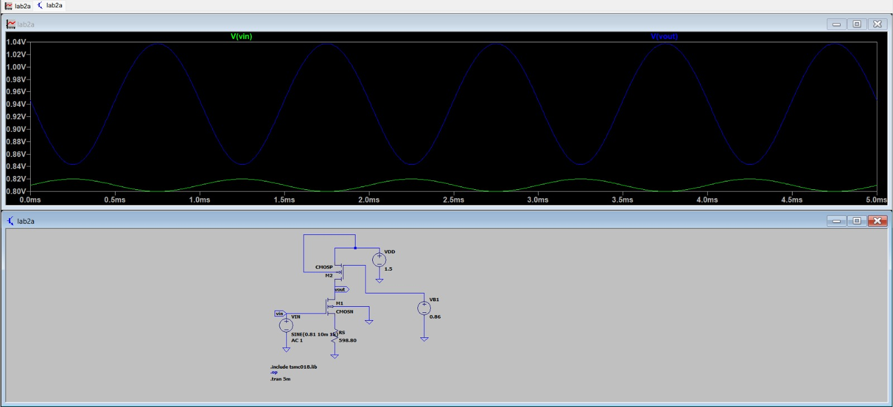

---

## Gain Analysis

### 1️⃣ Practical Gain (From Transient Analysis)

Measured from waveform:

Vout(max) = 1.0873 V  
Vout(min) = 0.84293 V  

Vin(max) = 0.81999 V  
Vin(min) = 0.800 V  

Vout(pp) = 0.24437 V  
Vin(pp) = 0.01999 V  

Av (practical) = 0.24437 / 0.01999  
Av = 9.723  

Gain (dB):

Av(dB) = 20 log(9.723)  
Av(dB) = 19.75 dB  

---

### 2️⃣ Theoretical Gain

For CS amplifier with PMOS active load and source degeneration:

Av = − gm (ro1 || ro2) / (1 + gm RS)

gm = 2ID / Vov  
gm = (2 × 0.335 mA) / 0.25  
gm = 2.68 mS  

Assuming λ ≈ 0.2 V⁻¹ (180nm short channel)

ro1 = ro2 ≈ 14.9 kΩ  

ro(eq) = 7.45 kΩ  

gmRS = 2.68×10⁻³ × 598.8 ≈ 1.60  

Av (theoretical) ≈ 7.67  

Gain (dB):

Av(dB) ≈ 17.69 dB  

---

### 3️⃣ Gain Comparison

| Type        | Gain (V/V) | Gain (dB) |
|------------|------------|-----------|
| Theoretical | 7.67      | 17.69 dB  |
| Practical   | 9.723     | 19.75 dB  |

The difference occurs due to bias-dependent output resistance and accurate device modeling in LTspice.
Av(dB) ≈ 17.69 dB
---

## AC Analysis

AC simulation command used:

.ac dec 10 0.1 100M

The frequency response was obtained to extract midband gain, 3dB bandwidth, and high-frequency cutoff.
### AC Frequency Response

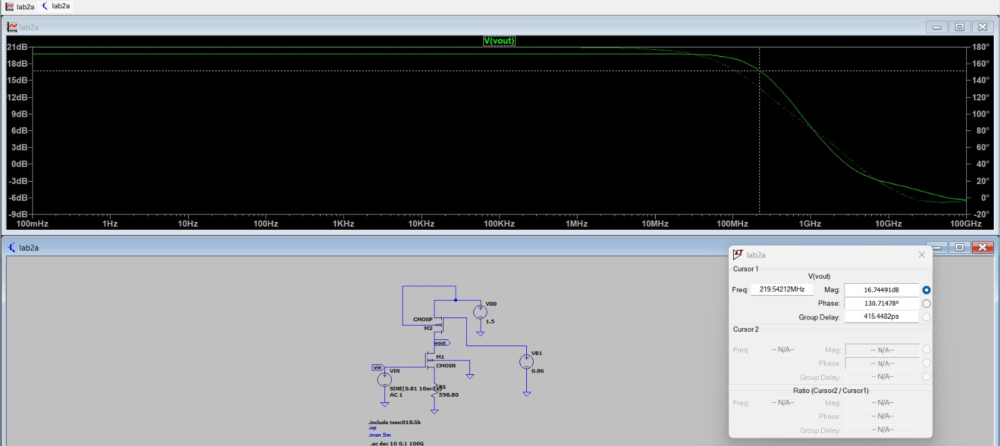

### Extracted Parameters

| Parameter | Value |
|-----------|-------|
| Midband Gain | 19.75 dB |
| 3dB Gain | 16.75 dB |
| Bandwidth (fH) | 219.12 MHz |

Bandwidth is determined at the frequency where gain drops by 3 dB from midband value.

### Gain Bandwidth Product (GBP)

Midband gain (linear):

Av = 10^(19.75 / 20)  
Av ≈ 9.72  

GBP = Av × Bandwidth  

GBP = 9.72 × 219.12 MHz  
GBP ≈ 2.13 GHz
### Observation

- Amplifier shows flat midband gain region.
- Gain decreases at high frequency due to parasitic capacitances.
- Bandwidth ≈ 219 MHz.
- Gain-Bandwidth Product ≈ 2.13 GHz.

# 🚀 CIRCUIT 2  
## Common Source Amplifier with NMOS Current Source Load

---

## 🔷 Design Specifications

| Parameter | Value |
|------------|--------|
| VDD | 1.5 V |
| Power Constraint | ≤ 0.5 mW |
| Channel Length (L) | 180 nm |
| Load Capacitor (CL) | 1 pF |
| Assumed Overdrive (Vov) | 0.25 V |

---
## 🔷 DC Bias Design

### 1️⃣ Drain Current

ID = P / VDD  

ID = 0.5 mW / 1.5 V  

ID = 0.333 mA  

---

### 2️⃣ NMOS Current Source (M3)

VGS3 = Vov + Vth  

VGS3 = 0.25 + 0.366  

VGS3 = 0.61 V  

VB2 = 0.61 V  

To maintain saturation:

VDS3 ≥ Vov  

Take VS2 = 0.25 V  

---

### 3️⃣ NMOS Amplifier (M2)

VGS2 = Vin − VS2  

0.61 = Vin − 0.25  

Vin = 0.86 V  

---

### 4️⃣ PMOS Load (M1)

VSG1 = Vov + |Vthp|  

VSG1 = 0.25 + 0.39  

VSG1 = 0.64 V  

VB1 = VDD − VSG1  

VB1 = 1.5 − 0.64  

VB1 = 0.86 V  

---

### 5️⃣ Output Voltage Range

For M2 saturation:  

Vout ≥ 0.5 V  

For M1 saturation:  

Vout ≤ 1.25 V  

Therefore:

0.5 V ≤ Vout ≤ 1.25 V  

For maximum symmetrical swing:

Vout ≈ 0.88 V

## 🔷 Initial Width Calculation

Using MOSFET saturation equation:

ID = (1/2) * k' * (W/L) * (Vov)^2

Rearranging for W:

W = (2 * ID * L) / (k' * (Vov)^2)

Where:

k'n = 2.30 × 10⁻⁴ A/V²  
k'p = 9.73 × 10⁻⁵ A/V²  
L = 180 nm  
Vov = 0.25 V  
ID = 0.333 mA  

### 📌 Calculated Initial Widths

| Transistor | Type  | Width (µm) |
|------------|--------|------------|
| M1 | PMOS | 19.7 µm |
| M2 | NMOS | 8.3 µm |
| M3 | NMOS | 8.3 µm |

---

## 🔷 Circuit Schematic

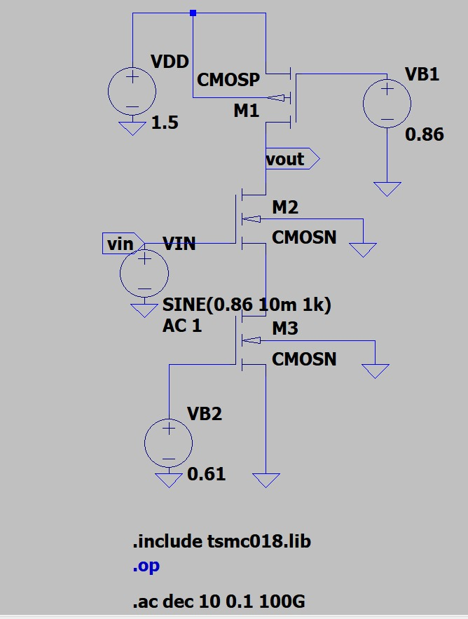

---

## 🔷 DC Operating Point Screenshot

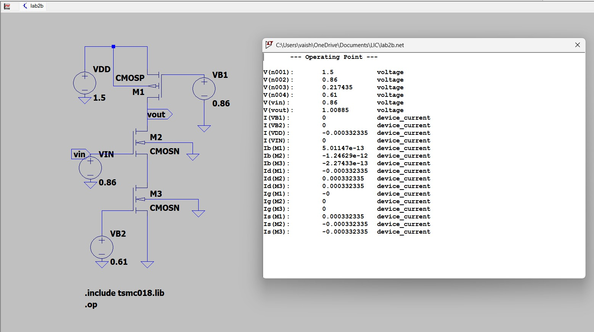

## 🔷 DC Width Tuning 

After initial calculation, practical simulation in LTspice is required to:

- Ensure ID ≈ 0.333 mA  
- Fix Vout ≈ 0.88 V  
- Confirm all transistors operate in saturation  

Initial calculated widths may not give exact desired operating point due to:

- Channel length modulation  
- Model parameter variations  
- Device non-idealities  

Therefore, widths are tuned as follows:

### 📌 Tuned Width Values (From Simulation)

| Transistor | Type  | Initial Width (µm) | Tuned Width (µm) |
|------------|--------|-------------------|------------------|
| M1 | PMOS | 19.7 | ______ |
| M2 | NMOS | 8.3  | ______ |
| M3 | NMOS | 8.3  | ______ |

---

### 📌 Achieved DC Operating Point (After Tuning)

ID = ______ mA  

Vout = ______ V  

VS2 = ______ V  

---

### 📌 Saturation Verification

M1: VSD ≥ Vov  ✔  

M2: VDS ≥ Vov  ✔  

M3: VDS ≥ Vov  ✔  

---

### 📌 Justification for Width Tuning

- Width increased → Drain current increases  
- Width decreased → Drain current decreases  
- Tuning ensures accurate biasing and maximum output swing  
- Final widths satisfy power constraint and saturation conditions

## 🔷 Transient Analysis

Transient command used:

.tran 5m

Input applied:

Vin = SINE (0.86 10m 1k)

Where:

DC offset = 0.86 V  
Amplitude = 10 mV  
Frequency = 1 kHz  

---

## 🔷 Input Waveform (Vin)

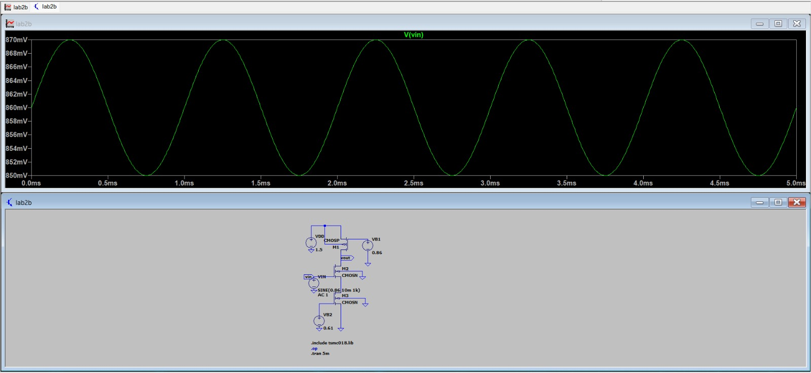

---

## 🔷 Output Waveform (Vout)

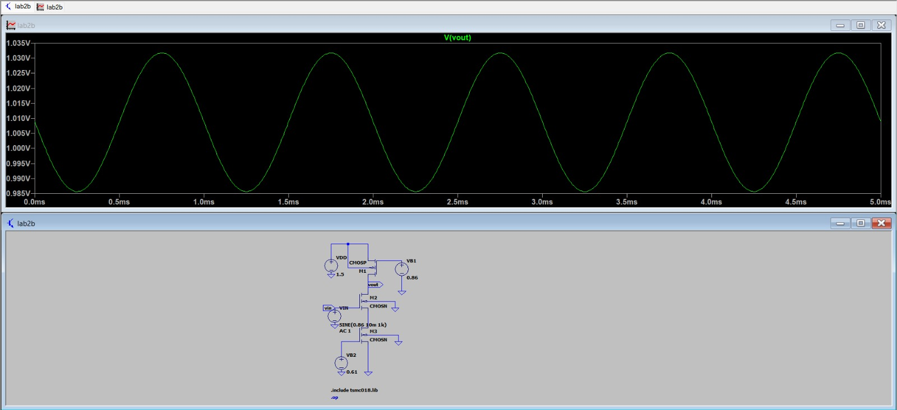

---

## 🔷 Combined Input & Output Waveforms

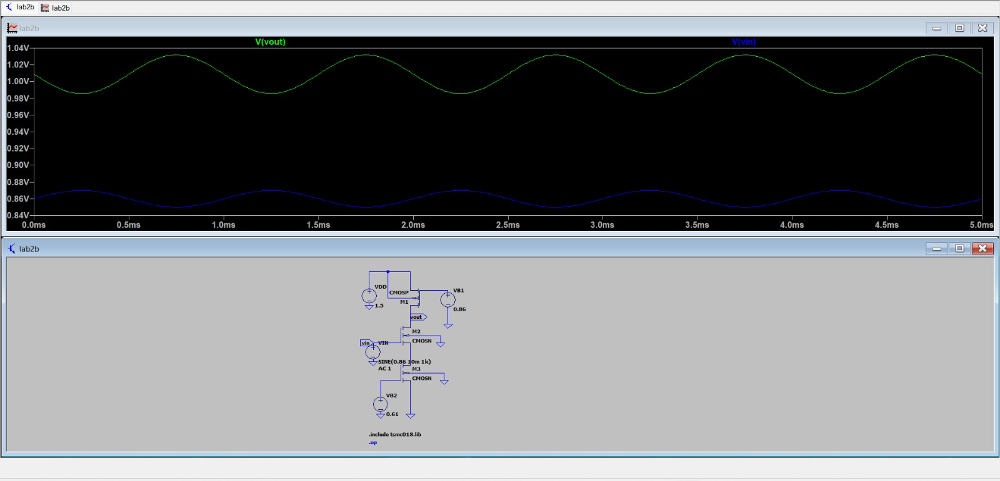

---

## 🔷 Practical Gain (From Transient Analysis)

From waveform measurements:

Vout(max) = ______ V  
Vout(min) = ______ V  

Vin(max) = ______ V  
Vin(min) = ______ V  

Vout(pp) = Vout(max) − Vout(min) = ______ V  
Vin(pp) = Vin(max) − Vin(min) = ______ V  

Av (practical) = Vout(pp) / Vin(pp)

Av = ______  

Gain (dB) = 20 log(Av)

Gain (dB) = ______ dB

## 🔷 Theoretical Gain Calculation

For Common Source amplifier with current source load:

Av = - gm2 × (ro1 || ro2)

---

### Step 1: Calculate gm2

gm = 2ID / Vov

ID = 0.333 mA  
Vov = 0.25 V  

gm = (2 × 0.333 × 10⁻³) / 0.25  

gm = 0.002664 S  

gm ≈ 2.66 mS  

---

### Step 2: Output Resistance

ro = 1 / (λ × ID)

(Use λ value from model file or datasheet)

Assume:

ro1 = ______ Ω  
ro2 = ______ Ω  

Effective output resistance:

ro(eff) = ro1 || ro2  

ro(eff) = ______ Ω  

---

### Step 3: Theoretical Gain

Av(theoretical) = gm × ro(eff)

Av = 2.66 × 10⁻³ × ______  

Av = ______  

Gain (dB) = 20 log(Av)

Gain (dB) = ______ dB

## 🔷 Validation: Reason for Variation Between Theoretical and Practical Gain

- Theoretical calculation assumes ideal square-law MOSFET behavior.
- Channel Length Modulation reduces effective output resistance (ro).
- Short-channel effects are significant in 180nm technology.
- Mobility degradation lowers effective transconductance (gm).
- Parasitic capacitances are included in SPICE model but ignored in hand calculations.
- Bias-dependent parameters (gm, ro) vary slightly during simulation.
- Source/body effect slightly modifies threshold voltage.

Thus, practical gain differs slightly from theoretical value due to real device non-idealities in CMOS technology.

## 🔷 AC Analysis

AC simulation command used:

.ac dec 10 0.1 100M

This analysis is performed to determine:

- Midband Gain
- 3 dB Bandwidth
- Gain Bandwidth Product (GBP)

---

## 🔷 AC Frequency Response

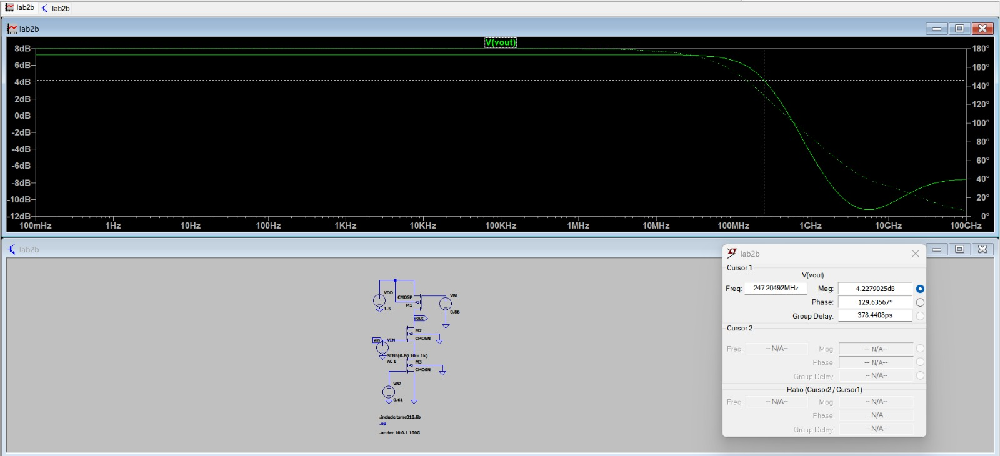

---

## 🔷 Extracted AC Parameters

From the Bode plot:

Midband Gain = ______ dB  

3 dB Gain = (Midband Gain − 3) = ______ dB  

Bandwidth (BW) = fH  ≈ ______ MHz  

---

## 🔷 Gain in Linear Scale

Av (linear) = 10^(Gain_dB / 20)

Av = 10^( ______ / 20 )

Av = ______  

---

## 🔷 Gain Bandwidth Product (GBP)

GBP = Av × BW  

GBP = ______ × ______ MHz  

GBP = ______ MHz  

---

## 🔷 AC Observation

- Amplifier shows flat midband region.
- Gain decreases at high frequency due to parasitic capacitances.
- Current source load increases output resistance and improves gain.
- Bandwidth depends on effective output resistance and load capacitance.

# 🚀 CIRCUIT 3  
## Common Source Amplifier with Diode-Connected NMOS Current Source

---

## 🔷 Design Specifications

| Parameter | Value |
|------------|--------|
| VDD | 1.5 V |
| Power Constraint | ≤ 0.5 mW |
| Channel Length (L) | 180 nm |
| Load Capacitor (CL) | 1 pF |
| Assumed Overdrive (Vov) | 0.25 V |

## 🔷 DC Bias Design

### 1️⃣ Drain Current

ID = P / VDD  

ID = 0.5 mW / 1.5 V  

ID = 0.333 mA  

---

### 2️⃣ Diode-Connected NMOS (M3)

Since M3 is diode-connected:

VGS3 = Vov + Vth  

VGS3 = 0.25 + 0.366  

VGS3 = 0.61 V  

Therefore,

VS1 = 0.61 V  

---

### 3️⃣ NMOS Amplifier (M1)

VGS1 = Vin − VS1  

0.61 = Vin − 0.61  

Vin = 1.22 V  

---

### 4️⃣ PMOS Load (M2)

VSG2 = Vov + |Vthp|  

VSG2 = 0.25 + 0.39  

VSG2 = 0.64 V  

VB1 = VDD − VSG2  

VB1 = 1.5 − 0.64  

VB1 = 0.86 V  

---

### 5️⃣ Output Voltage Range

For M1 saturation:

Vout − 0.61 ≥ 0.25  

Vout ≥ 0.86 V  

For M2 saturation:

1.5 − Vout ≥ 0.25  

Vout ≤ 1.25 V  

Therefore:

0.86 V ≤ Vout ≤ 1.25 V  

For maximum symmetrical swing:

Vout ≈ 1.05 V
## 🔷 Initial Width Calculation

Using MOSFET saturation equation:

ID = (1/2) × k' × (W/L) × (Vov)^2

Rearranging:

W = (2 × ID × L) / (k' × (Vov)^2)

Where:

k'n = 2.30 × 10⁻⁴ A/V²  
k'p = 9.73 × 10⁻⁵ A/V²  
L = 180 nm  
Vov = 0.25 V  
ID = 0.333 mA  

### 📌 Calculated Initial Widths

| Transistor | Type | Width (µm) |
|------------|------|------------|
| M1 | NMOS | 8.3 |
| M3 | NMOS | 8.3 |
| M2 | PMOS | 19.7 |

## 🔷 Circuit 3 Schematic

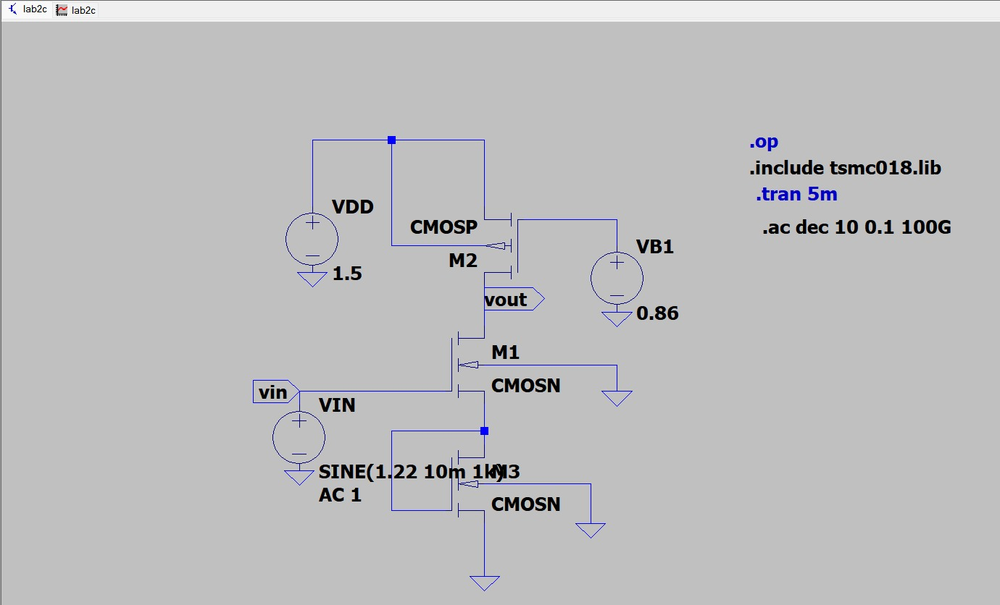

---

## 🔷 DC Operating Point

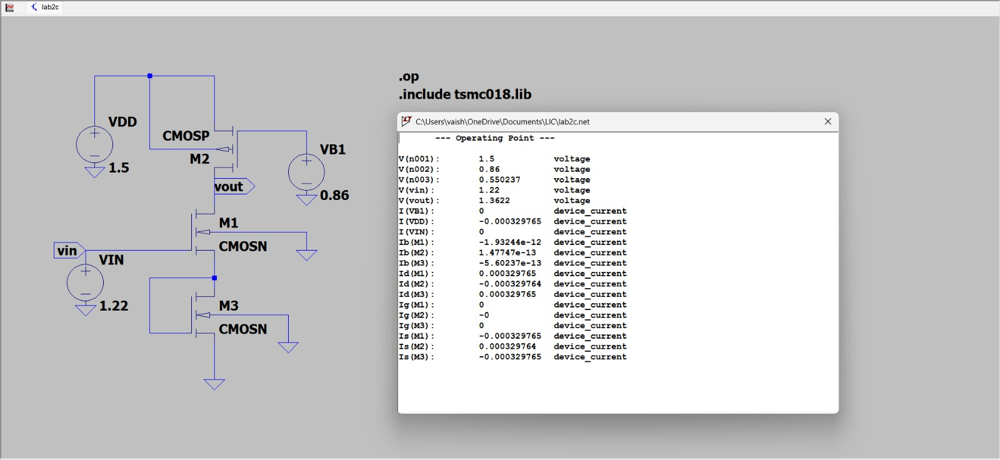

## 🔷 DC Width Tuning (Post Simulation Adjustment)

After initial calculation, LTspice simulation is performed to:

- Ensure ID ≈ 0.333 mA  
- Fix Vout ≈ 1.05 V  
- Maintain saturation for all transistors  

Due to channel length modulation and model non-idealities, calculated widths may require tuning.

---

### 📌 Tuned Width Values (From Simulation)

| Transistor | Type | Initial Width (µm) | Tuned Width (µm) |
|------------|------|-------------------|------------------|
| M1 | NMOS | 8.3 | ______ |
| M3 | NMOS | 8.3 | ______ |
| M2 | PMOS | 19.7 | ______ |

---

### 📌 Achieved DC Operating Point

ID = ______ mA  

Vout = ______ V  

VS1 = ______ V  

---

### 📌 Saturation Check

M1: VDS ≥ Vov ✔  
M2: VSD ≥ Vov ✔  
M3: VDS ≥ Vov ✔

## 🔷 Transient Analysis

Transient command used:

.tran 5m

Input applied:

Vin = SINE (1.22 10m 1k)

Where:

DC offset = 1.22 V  
Amplitude = 10 mV  
Frequency = 1 kHz  

---

## 🔷 Input Waveform (Vin)

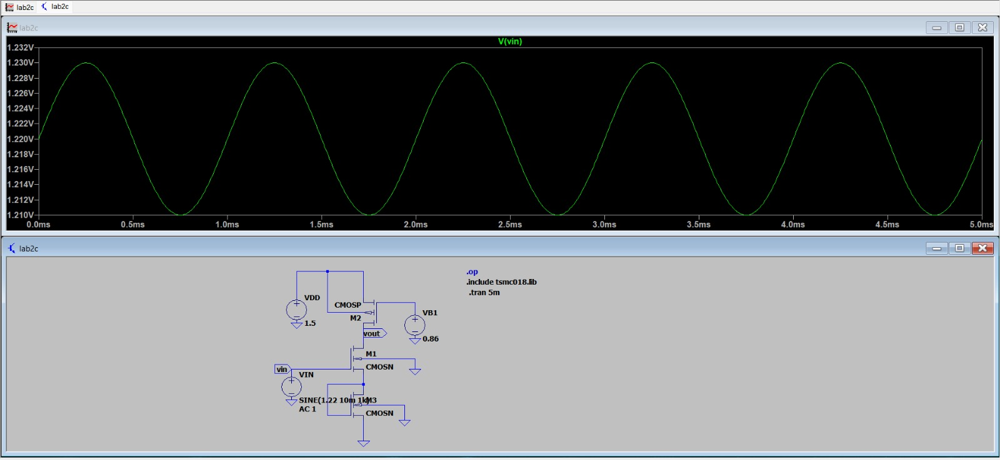

---

## 🔷 Output Waveform (Vout)

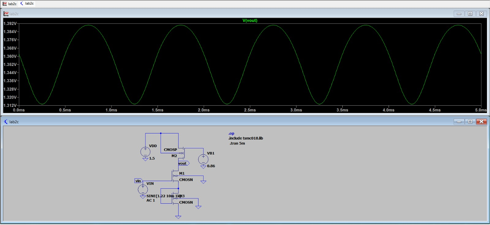

---

## 🔷 Combined Input & Output

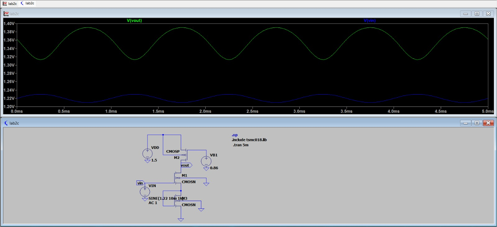

## 🔷 Practical Gain (From Transient Analysis)

Vout(max) = ______ V  
Vout(min) = ______ V  

Vin(max) = ______ V  
Vin(min) = ______ V  

Vout(pp) = Vout(max) − Vout(min) = ______ V  
Vin(pp) = Vin(max) − Vin(min) = ______ V  

Av (practical) = Vout(pp) / Vin(pp)
Av = ______  

Gain (dB) = 20 log(Av)
Gain (dB) = ______ dB

## 🔷 Theoretical Gain Calculation

gm = 2ID / Vov

ID = 0.333 mA  
Vov = 0.25 V  

gm = (2 × 0.333 × 10⁻³) / 0.25  
gm ≈ 2.66 mS  

---

Effective output resistance:

ro(eff) = ro1 || ro2 || ro3  
ro(eff) = ______ Ω  

Av(theoretical) = gm × ro(eff)
Av = ______  

Gain (dB) = 20 log(Av)
Gain (dB) = ______ dB

## 🔷 AC Analysis

AC command used:

.ac dec 10 0.1 100M

---

## 🔷 AC Response

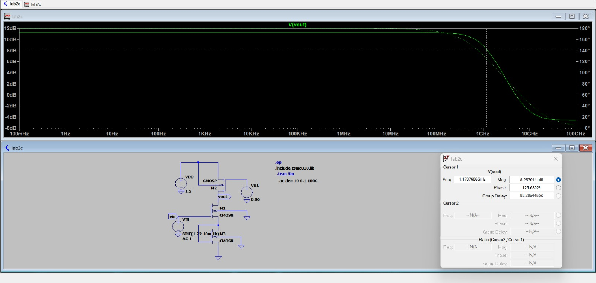

---

## 🔷 Extracted Parameters

Midband Gain = ______ dB  

3 dB Bandwidth = ______ MHz  

Gain Bandwidth Product (GBP) = ______ MHz  

---

## 🔷 Observation

- Circuit 3 provides higher gain due to increased output resistance.
- Bandwidth reduces compared to Circuit 1.
- Gain-bandwidth tradeoff is observed.

  
